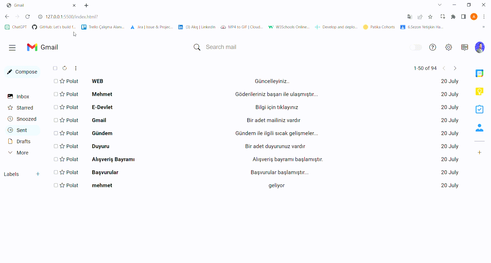

# Gmail Clone 

HTML, SCSS ve JavaScript kullanılarak oluşturulmuş basit bir e-posta istemcisi. Kullanıcıların e-posta gönderip silmelerine olanak sağlar. Ayrıca, e-postaları yıldızlamak için özel bir "Yıldızlılar" bölümü bulunmaktadır ve tüm veriler yerel depolamada saklanarak kalıcılık sağlanır. Ayrıca, kullanıcı deneyimini artırmak için koyu mod özelliği eklenmiştir.

## What i practice

- E-posta gönderme ve silme.
- Yıldızlılar bölümünde yıldızlanan e-postaları görüntüleme.
- Verilerin kalıcı olması için Local Storage kullanımı.
- Rahat bir kullanıcı deneyimi için koyu mod desteği.
- Tüm ekran boyutları için tam uyumluluk.

## `Screen`

# gmail-clone
